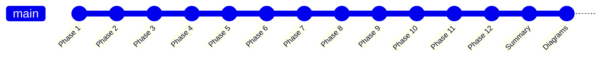

# Elderly Companion Robot — Dashboard

> [!success] Status (2026-05-19)
> **All 12 phases shipped**. Firmware production-ready. Pending: physical assembly → bring-up → 24h soak → deploy.

> [!tip] Resume cue
> Trong Claude Code: gõ **"tiếp tục elderly robot"** để resume.

---

## 📊 At a glance

| | |
|---|---|
| **MCU** | ESP32-S3-CAM N16R8 (16MB flash, 8MB PSRAM, OV3660 DVP) |
| **Phases done** | 12/12 ✓ |
| **Codebase** | ~17,000 lines (code + docs) |
| **FreeRTOS tasks** | 9 + HTTP worker |
| **Drivers** | 10 components |
| **HTTP endpoints** | 38 |
| **MQTT topics** | 6 publish + 1 subscribe |
| **BOM total** | ~700-800k VND |
| **GitHub** | https://github.com/yuHz23/elderly-companion-robot |

---

## 🚀 Quick navigation

### Top-level
- [[docs/HDSD-Lap-Rap-Robot|📖 HDSD master build guide]] (1044 lines, 12 phases)
- [[docs/PROJECT-SUMMARY|📋 Project summary]] (canonical overview)
- [[docs/diagrams/architecture-blocks|🗺️ Architecture block diagrams]] (9 Mermaid)
- [[docs/firmware/architecture|⚙️ Firmware architecture]]

### By category

> [!example]- 🔌 Hardware specs (click to expand)
> - [[docs/hardware/pin-mapping|Pin mapping (authoritative GPIO table)]]
> - [[docs/hardware/power-tree-spec|Power tree]] · [[docs/hardware/power-bringup|bring-up]]
> - [[docs/hardware/decoupling-network|Decoupling network]]
> - [[docs/hardware/pcb-layout-power|PCB layout — power section]]
> - [[docs/hardware/mcu-core-spec|MCU core]] · [[docs/hardware/mcu-bringup|bring-up]]
> - [[docs/hardware/ptz-spec|PTZ pan-tilt]] · [[docs/hardware/ptz-bringup|bring-up]]
> - [[docs/hardware/drive-spec|Drive train (L298N + BO motor)]] · [[docs/hardware/drive-bringup|bring-up]]
> - [[docs/hardware/sensor-spec|Sensor suite (IMU + 4x ultrasonic)]] · [[docs/hardware/sensor-bringup|bring-up]]
> - [[docs/hardware/audio-spec|Audio I/O (I2S mic+amp)]] · [[docs/hardware/audio-bringup|bring-up]]
> - [[docs/hardware/sim800l-spec|SIM800L cellular]] · [[docs/hardware/sim800l-bringup|bring-up]]
> - [[docs/hardware/dock-spec|Dock + charging]] · [[docs/hardware/dock-bringup|bring-up]]

> [!example]- 🧪 Test & deploy
> - [[docs/test/test-plan|Test plan (6 categories + edge cases)]]
> - [[docs/test/24h-soak-plan|24h soak procedure]]
> - [[docs/test/test-results-template|Test results template]]
> - [[docs/firmware/bringup-integration|Integration bring-up]]
> - [[docs/deploy/home-assistant|Home Assistant integration]]
> - [[docs/deploy/production-deploy|Production deployment guide]]
> - [[docs/deploy/ota-update|OTA update flow]]

> [!example]- 🔧 Mechanical
> - [[mechanical/chassis-spec|Chassis specification]]
> - [[mechanical/assembly-phase1|Phase 1 assembly guide]]
> - `mechanical/chassis-layer1.svg` / `.dxf` (top)
> - `mechanical/chassis-layer2.svg` / `.dxf` (bottom)
> - `mechanical/generate_dxf.py` (Python regenerator)

> [!example]- 💻 Firmware
> - `firmware/platformio.ini` (build config)
> - `firmware/partitions.csv` (16MB layout, 2 OTA slots)
> - `firmware/sdkconfig.defaults` (Octal PSRAM, USB-CDC)
> - `firmware/main/main.c` + `smoke_test.c` (entry + HTTP)
> - `firmware/drivers/*` (10 HAL components)
> - `firmware/tasks/*` (9 FreeRTOS task)
> - `firmware/utils/*` (wifi_manager, robot_mqtt, self_test)

---

## ✅ 12-phase progress

```mermaid
graph LR
    P1[Phase 1<br/>Chassis] --> P2[Phase 2<br/>Power] --> P3[Phase 3<br/>MCU+Cam] --> P4[Phase 4<br/>PTZ]
    P4 --> P5[Phase 5<br/>Drive] --> P6[Phase 6<br/>Sensors] --> P7[Phase 7<br/>Audio] --> P8[Phase 8<br/>SOS]
    P8 --> P9[Phase 9<br/>Dock] --> P10[Phase 10<br/>Integration] --> P11[Phase 11<br/>Test] --> P12[Phase 12<br/>Deploy]
    classDef done fill:#2a6e4d,color:#fff,stroke:#44cc88
    class P1,P2,P3,P4,P5,P6,P7,P8,P9,P10,P11,P12 done
```



| Phase | Commit | Status | Bring-up doc |
|-------|--------|--------|--------------|
| 1. Chassis | `ad78a6a` | ✓ Code ready | [[mechanical/assembly-phase1]] |
| 2. Power tree | `c0431ee` | ✓ Code ready | [[docs/hardware/power-bringup]] |
| 3. MCU + camera | `c4d550f` | ✓ Code ready | [[docs/hardware/mcu-bringup]] |
| 4. PTZ | `5df4ec1` | ✓ Code ready | [[docs/hardware/ptz-bringup]] |
| 5. Drive | `096c871` | ✓ Code ready | [[docs/hardware/drive-bringup]] |
| 6. Sensors | `ce96567` | ✓ Code ready | [[docs/hardware/sensor-bringup]] |
| 7. Audio | `954ab20` | ✓ Code ready | [[docs/hardware/audio-bringup]] |
| 8. SOS | `52aa242` | ✓ Code ready | [[docs/hardware/sim800l-bringup]] |
| 9. Dock | `064bbb7` | ✓ Code ready | [[docs/hardware/dock-bringup]] |
| 10. Integration | `32b1329` | ✓ Code ready | [[docs/firmware/bringup-integration]] |
| 11. Test | `630319d` | ✓ Code ready | [[docs/test/test-plan]] |
| 12. Deploy | `dea7ea7` | ✓ Code ready | [[docs/deploy/production-deploy]] |

---

## 🛒 Hardware BOM checklist

### Đã có (từ Sesame + previous projects)
- [x] ESP32-S3-CAM N16R8 (XiaoZhi)
- [x] MPU6050 GY-521
- [x] SSD1306 OLED 128×64
- [x] MG90S × 8 (dùng 2 cho PTZ)
- [x] INMP441 MEMS mic
- [x] MAX98357A I2S amp + 3W speaker
- [x] SIM800L GSM module

### Cần mua

> [!todo] Robot side (~400k VND)
> - [ ] L298N module — 25k
> - [ ] 2× BO motor + bánh xe 65mm — 100k
> - [ ] 4× HC-SR04 — 60k
> - [ ] 3× 18650 Samsung/LG — 150k
> - [ ] 3S BMS + balance — 30k
> - [ ] LM2596S-ADJ × 2 + AP2112K + caps/resistors — 50k
> - [ ] Spring contact pogo × 2 — 10k
> - [ ] Acrylic 3mm laser-cut 200×150mm × 2 — 50k
> - [ ] 3D-print PTZ mount PLA — 50k
> - [ ] Standoff M3×30 × 6, vít, đai ốc — 30k
> - [ ] Nano SIM 2G + nạp tiền — 50k

> [!todo] Dock station (~165k VND)
> - [ ] AC adapter 12.6V/3A — 80k
> - [ ] Copper plate đồng đỏ 60×30 × 2 — 25k
> - [ ] IR LED 940nm + 38kHz module — 15k
> - [ ] Acrylic 5mm 150×120 — 30k
> - [ ] Diode SS54 + fuse + LED — 10k
> - [ ] Dây silicone 18AWG — 5k

---

## 🧪 Test progress

> [!todo] Test 1-6 functional (~3-4 giờ)
> - [ ] Test 1 — Smoke test (1h idle)
> - [ ] Test 2 — Drive train (straight + rotate + brake)
> - [ ] Test 3 — Camera + audio + PTZ
> - [ ] Test 4 — Docking 20× (target 80% success)
> - [ ] Test 5 — Fall detection 10× (TP ≥ 9, FP = 0)
> - [ ] Test 6 — SOS 3× end-to-end

> [!todo] Test 7-8 stress (~25 giờ)
> - [ ] Test 7 — Edge cases (WiFi flap, brownout, stall)
> - [ ] Test 8 — 24h soak (4× cycles)

> [!todo] Deployment
> - [ ] On-site WiFi setup
> - [ ] Dock mounting (tường, cao 80mm)
> - [ ] SOS contacts programmed + test SMS
> - [ ] HASS broker connected
> - [ ] Schedule customized to user lifestyle
> - [ ] User trained (OLED reading, E-stop)
> - [ ] 1-month follow-up scheduled

---

## 🎯 Critical design decisions

> [!warning] SIM800L power isolation
> Rail 4V tách riêng buck #2, KHÔNG share rail 5V. 2A GSM TX burst sẽ kéo sụt rail 5V → ESP32 reset. Đây là sai lầm phổ biến nhất ở DIY ESP32 + GSM projects.

> [!warning] GPIO12 strapping
> Phải có R 10kΩ pull-down trên GPIO12. ESP32-S3-CAM N16R8 (Octal PSRAM 1.8V) cần GPIO12 LOW lúc reset để chọn đúng flash voltage. Lỗi #1 phổ biến → boot loop.

> [!warning] Motor PWM cap
> Driver cap PWM tối đa 70% (xem `motor_l298n.c` `PWM_CAP_PCT`). L298N drop 2.5V trên 12V → 9.5V; BO motor spec 6V → cap 70% ≈ 6.65V để bảo vệ motor.

> [!info] LEDC channel allocation
> Camera ch0 (Phase 3) · Servo ch2-3 (Phase 4) · Motor ch4-5 (Phase 5). **Không dùng ch1** — reserved nếu cần future PWM.

> [!info] Front-docking trade-off
> Camera quay vào tường khi docked. Đơn giản hóa (không cần 180° turn). Acceptable vì:
> - PTZ vẫn quay được khi idle on dock
> - Stream chỉ critical khi PATROL, không khi docked

---

## 🚫 Out of scope (Phase 13+)

Các capability chưa làm — separate effort sau:

- **Voice pipeline đầy đủ**: wake word → STT → Claude API → TTS. Scaffolded trong [[docs/hardware/audio-spec|audio-spec]] §7. Cost ~$15-30/tháng. Cần esp-sr + esp-adf + cloud APIs.
- **OTA endpoint**: partition + rollback ready, code chưa implement. Document trong [[docs/deploy/ota-update|ota-update]].
- **Vision-based path planning**: PATROL hiện là random walk. TFlite Micro để SLAM.
- **Secure boot + signed images**: production hardening.
- **Multi-robot fleet**: 1 broker, nhiều robot.

---

## 📈 Recent commits



| Latest commit | Phase / topic |
|---------------|---------------|
| `5855b6d` | Architecture block diagrams (9 Mermaid) |
| `816629a` | Canonical project summary |
| `dea7ea7` | **Phase 12** — Deploy + HASS |
| `630319d` | **Phase 11** — Test + self-test |
| `32b1329` | **Phase 10** — Integration + behavior FSM |

→ Xem full log: `git log --oneline` trong [[D:/elderly-companion-robot]]

---

## 🔗 External references

- **GitHub repo**: https://github.com/yuHz23/elderly-companion-robot
- **Reference projects** (Pattern over Invention):
  - [Watney Rover](https://github.com/nikivanov/watney) — chassis + dock
  - [Rudra](https://github.com/aceta-minophen/Rudra) — PTZ
  - [Caretaker](https://github.com/positron48/robot) — spring contact
  - [XiaoZhi ESP32](https://github.com/78/xiaozhi-esp32) — voice firmware base
  - [osrf/autodock](https://github.com/osrf/autodock) — docking FSM

- **ESP-IDF docs**: https://docs.espressif.com/projects/esp-idf/en/stable/esp32s3/
- **PlatformIO**: https://platformio.org/

---

## 🛠️ Common commands

```bash
# Build & flash firmware
cd D:\elderly-companion-robot\firmware
pio run -e esp32-s3-cam -t upload
pio device monitor

# Open web UI (after WiFi connected)
http://<robot-ip>/

# Run self-diagnostic
curl http://<robot-ip>/diag/selftest | jq

# Configure MQTT broker
curl "http://<robot-ip>/mqtt/config?uri=mqtt://user:pw@hass-ip:1883"

# Configure SOS contacts
curl "http://<robot-ip>/sos/config?phone1=+84909..."

# Regenerate chassis DXF
cd D:\elderly-companion-robot\mechanical
python generate_dxf.py
```

---

## 📝 How to use this dashboard

1. **Pin tab in Obsidian**: right-click tab → Pin
2. **Set as homepage**: Settings → Core plugins → Homepage → pick `Dashboard`
3. **Quick switcher** (Ctrl+O): type "Dash" → jump back here anytime
4. **Tags**: dùng `#phase/1`, `#bringup`, `#blocked` để filter

---

*Last updated: 2026-05-19 — Dashboard auto-tracked. Edit để add personal notes hoặc TODO mới.*
