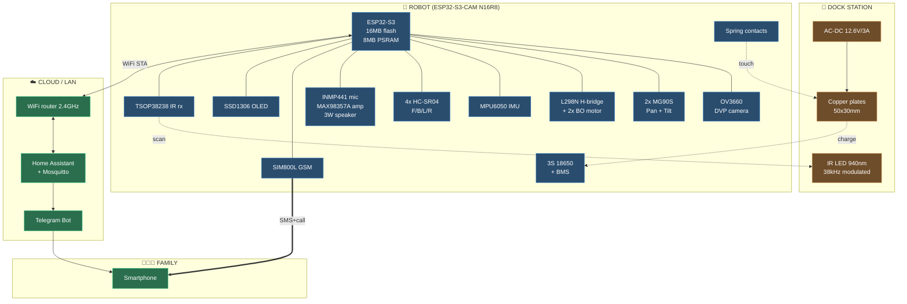
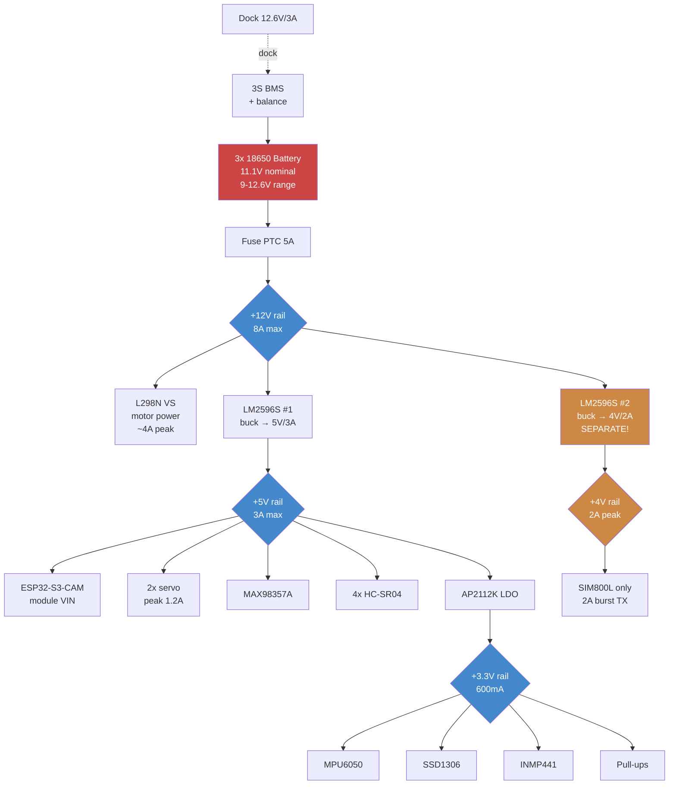
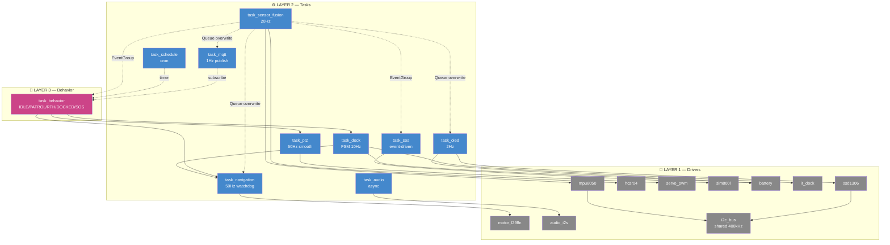
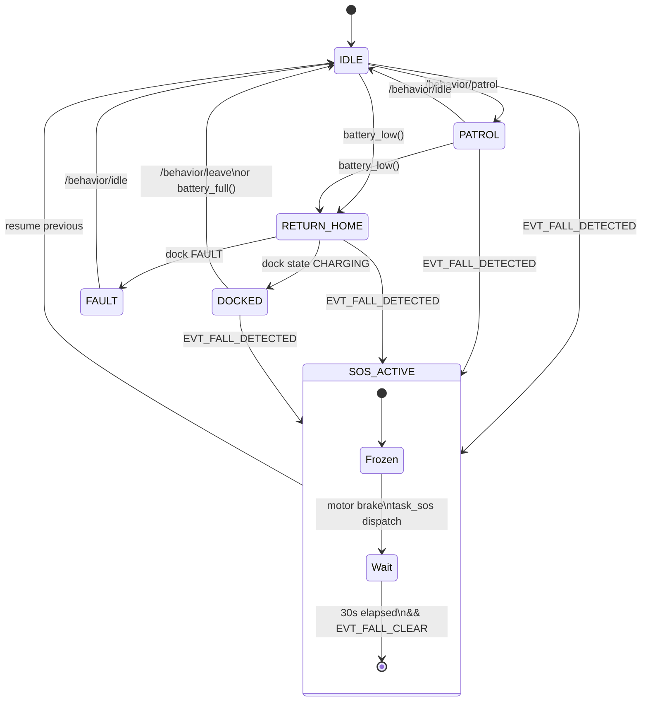
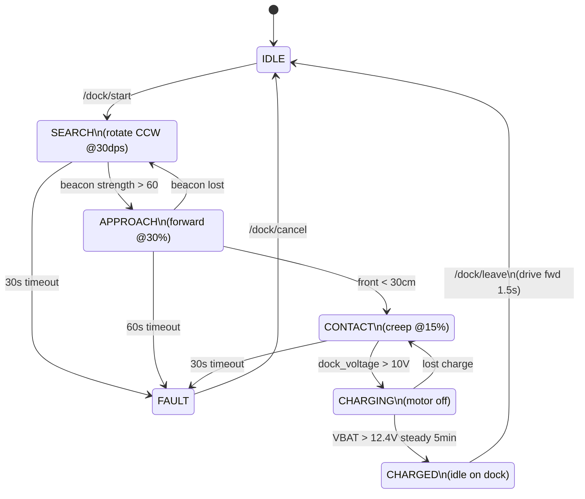
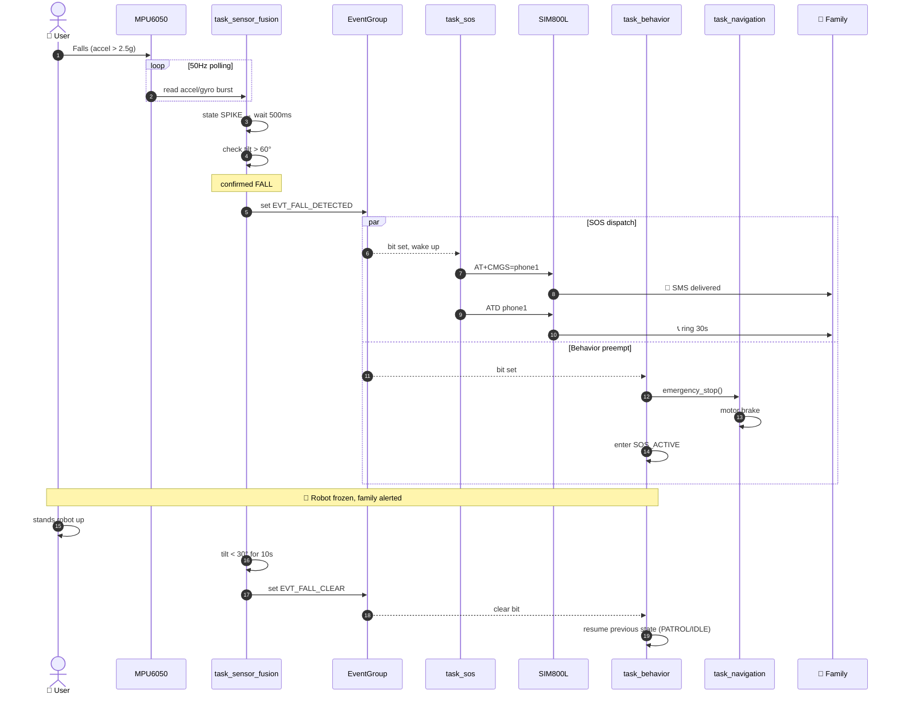
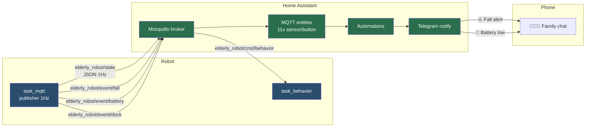
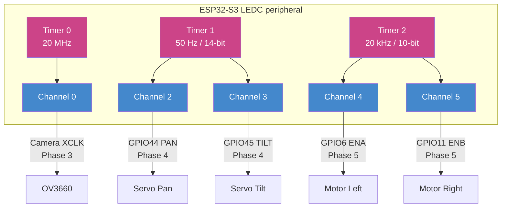

# Architecture Block Diagrams

> Mermaid diagrams render natively in Obsidian (no plugin needed). Right-click any diagram → "Open in new tab" để xem fullscreen.
>
> **Related**: [[../PROJECT-SUMMARY|Project Summary]] · [[../firmware/architecture|Firmware Architecture]] · [[../HDSD-Lap-Rap-Robot|HDSD Master Guide]]

---

## 1. System-level block diagram

Hardware overview — robot + dock + cloud:

---

## 2. Power tree (4 rails từ battery)

> **Critical**: rail 4V tách riêng buck #2 (không cascade từ 5V). Lý do: SIM800L burst 2A trong 577µs sẽ kéo sụt rail 5V → ESP32 reset.

---

## 3. Firmware task graph

9 FreeRTOS task + 10 driver, data flow:

---

## 4. Behavior FSM (top-level)

---

## 5. Dock FSM (task_dock)

---

## 6. Fall → SOS sequence (event flow)

---

## 7. MQTT integration topology

---

## 8. Daily schedule timeline

```mermaid
gantt
    title Robot daily routine (NVS-configurable)
    dateFormat HH:mm
    axisFormat %H:%M

    section Morning
    Leave dock      :a1, 06:00, 30m
    Patrol          :a2, after a1, 4h

    section Lunch
    Return home     :b1, 12:00, 30m
    Charge          :b2, after b1, 2h
    Leave dock      :b3, 14:00, 30m

    section Evening
    Patrol evening  :c1, 19:00, 3h
    Return home     :d1, 22:00, 30m
    Night charge    :d2, after d1, 8h
```

> Adjust qua `GET /schedule/set?i=0&h=7&m=30&cmd=leave` để fit nhịp sinh hoạt người dùng.

---

## 9. LEDC peripheral allocation

---

## How to read these in Obsidian

- **Ctrl+P → Toggle Mermaid render**: switch raw ↔ rendered
- **Right-click diagram → Open in new tab**: fullscreen
- **Ctrl+, → Editor → Reading view**: always show rendered
- **Pan/zoom**: hold Ctrl + scroll wheel

For graphviz-style fancy layouts beyond Mermaid, install **Excalidraw** community plugin — best-in-class for whiteboard-style drawings.

---

## Diagram source references

| # | Diagram | Source spec |
|---|---------|-------------|
| 1 | System block | [[../PROJECT-SUMMARY#2-hardware-tổng-quan]] |
| 2 | Power tree | [[../hardware/power-tree-spec#1-kiến-trúc-tổng-thể]] |
| 3 | Task graph | [[../firmware/architecture#1-4-layer-stack]] |
| 4 | Behavior FSM | [[../firmware/architecture#5-top-level-behavior-fsm]] |
| 5 | Dock FSM | [[../hardware/dock-spec#4-state-machine-docking]] |
| 6 | Fall→SOS | [[../hardware/sensor-spec#4-fall-detection-algorithm]] + [[../hardware/sim800l-spec]] |
| 7 | MQTT topology | [[../deploy/home-assistant]] |
| 8 | Daily schedule | task_schedule defaults |
| 9 | LEDC allocation | [[../firmware/architecture#5-mapping-vào-kicad-schematic]] |
